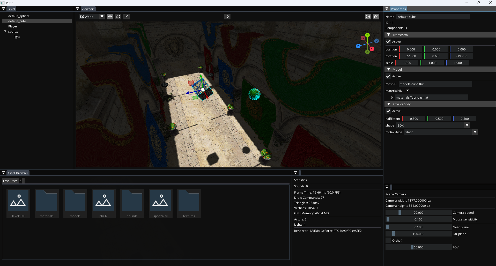
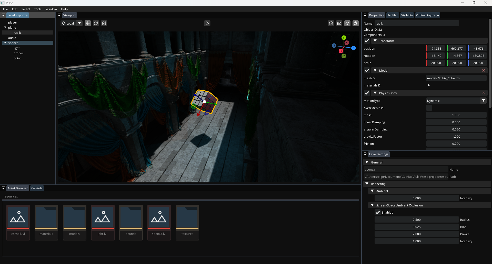

<h1 align="center">Pulse Engine</h1>

  <picture>
    <source media="(prefers-color-scheme: dark)" srcset=".github/PulseLogoDarkMode.png" width="15%">
    <source media="(prefers-color-scheme: light)" srcset=".github/PulseLogoLightMode.png" width="15%">
    
  </picture>

  Yet another game engine 
  (full of bugs)

## ScreenShot

## Build Requirements (Windows)

### Build tools :
- CMake 3.28.2 or later
- C++ 17 Compiler (GCC MinGW recommended)

### Proprietary Dependencies :
- Qt 6.9.2
- FMOD API 2.03

### Editor Fonts : (Place both in src/editor/gui/fonts/)
- [OpenSans-Regular.ttf](https://github.com/googlefonts/opensans)
- [lucide.ttf](https://unpkg.com/lucide-static@latest/font/lucide.ttf)

## Build Requirements (Linux) :

<h3><i style="color:green"># Still WIP</i></h3>

## How to build :

Build jolt inside its submodule folder, build QtADS, place the fonts inside their folder

Run build.bat or build.sh (depending on your OS)

This will compile everything from root : submodules, the engine, the editor app, the editor module, and the game module (loaded with the game app)

## ROADMAP EDITOR

- [x] Docking
- [x] Scene Tree panel
  - [ ] Keyboard shortcuts
  - [ ] Multi selection
  - [ ] Template actors creation
- [ ] Material editor panel
- [ ] Components panel
- [ ] Viewport panel
- [ ] Asset Browser
- [ ] Console
- [ ] Stats overlay
  - [x] Audio source count
  - [x] Minimal frame profiler (FPS, Draw Calls, Lights counts, etc...)
  - [ ] Hardware infos (CPU, GPU, RAM) (Name, Vendor, Usage...)

## ROADMAP ENGINE

### Rendering

- [x] Skyboxes
  - [x] IBL
- [x] Wireframe rendering
- [ ] Forward+ rendering
- [ ] Ligthmaps
- [ ] FBX importer (multiple meshes)
- [ ] Post processing effects shaders (SSAO, Bloom, Vignette, Tone Mapping, Film Grain, Chromatic Abberration)

#### Serialization

- [x] Component serialization
- [x] Level exporter
- [x] Project exporter (project file + asset database)
- [ ] Material file exporter

#### Debugging

- [ ] Commands (in game/editor)
- [ ] Frame-Debugger (see stats overlay)

#### Animation system

- [ ] Animation data structure importing (from FBX)
- [ ] Animation data manager
- [ ] Skeletal animations
- [ ] Animation Blending
- [ ] Animation State Machine

## Credits/Dependencies

- Libraries/Projects :
  - [Qt](https://www.qt.io/)
  - [Qt imgui backend](https://github.com/seanchas116/qtimgui)
  - [Qt ads](https://github.com/githubuser0xFFFF/Qt-Advanced-Docking-System)
  - [GLFW](https://github.com/glfw/glfw)
  - [GLM](https://github.com/g-truc/glm)
  - [Jolt](https://github.com/jrouwe/JoltPhysics)
  - [IconFontCppHeaders](https://github.com/juliettef/IconFontCppHeaders)
  - [ImGui](https://github.com/ocornut/imgui)
  - [ImGuizmo](https://github.com/CedricGuillemet/ImGuizmo)
  - [freetype](https://github.com/freetype/freetype)
  - [glad](https://github.com/Dav1dde/glad)
  - [ufbx](https://github.com/ufbx/ufbx)
  - [json for c++](https://github.com/nlohmann/json)
  - [fmod](https://www.fmod.com/)

- Fonts :
  - [Lucide icons](https://lucide.dev/)
  - [Open Sans](https://fonts.google.com/specimen/Open+Sans)

- Sounds/Music :
  - [TownTheme.mp3](https://opengameart.org/content/town-theme-rpg)

- Models :
  - "Rubik's Cube" (<https://skfb.ly/6U7pp>) by RED2000 is licensed under Creative Commons Attribution (<http://creativecommons.org/licenses/by/4.0/>).
  - "Sponza" Model downloaded from Morgan McGuire's [Computer Graphics Archive](https://casual-effects.com/data)
  - "Cerberus" Gun model [Andrew Maximov](https://artisaverb.info/PBT.html) 

- Textures :
  - [Qwantani Afternoon (Pure Sky)](https://polyhaven.com/a/qwantani_afternoon_puresky)